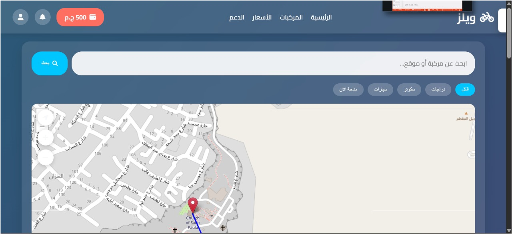
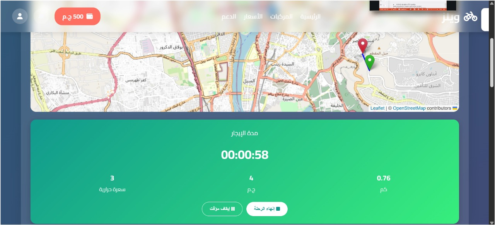

#  Wheels

A responsive front-end web application for bike and ride sharing that helps users find nearby vehicles, choose pickup and destination locations, and start rides through an interactive map interface.

##  Features

- Browse available bikes and scooters.
- Search for nearby vehicles.
- Interactive maps using Leaflet.js & OpenStreetMap.
- Select pickup and destination locations.
- Start and end rides.
- Display ride duration, distance, and estimated cost.
- Responsive user interface for desktop and mobile.

##  Technologies Used

- HTML5
- CSS3
- JavaScript
- Leaflet.js
- OpenStreetMap
- Font Awesome

---

#  Screenshots

##  Home Page

---

##  Available Vehicles

---

##  Interactive Map

---

##  Active Ride

---

##  Station Selection

---

##  Ride Statistics

---

##  Project Goal

To provide a simple and responsive ride-sharing interface that enables users to locate nearby vehicles, choose routes using interactive maps, and manage their trips efficiently.

##  Future Improvements

- User Authentication
- Backend Integration
- Real-time GPS Tracking
- Online Payments
- Ride History
- Notifications
